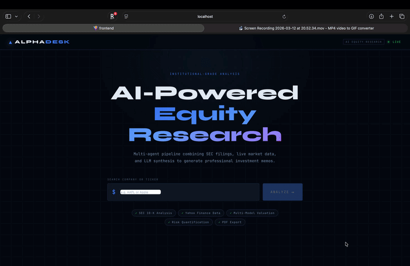

# Autonomous Financial Research Agent

> A multi-agent AI system that researches companies, synthesizes SEC filings, and writes institutional-grade investment memos — fully autonomously. What takes a junior analyst 2 days takes this system under 2 minutes.



---

## Screenshots

| Financial Snapshot + Investment Memo | Risk Gauge + Valuation Football Field |
|---|---|
|  |  |

---

## What It Does

Enter any S&P 500 ticker. The system runs a 6-agent LangGraph pipeline that:

1. Searches recent news via Tavily
2. Pulls the latest SEC 10-K filing from EDGAR
3. Fetches 30+ live financial metrics from Yahoo Finance
4. Scores risk 1–10 using Gemini 2.0 Flash with 8 domain override rules
5. Runs a multi-model valuation engine (auto-selects DCF / EV/EBITDA / P/B / P/E / Revenue Multiple by company type)
6. Synthesizes everything into a Goldman-style investment memo + 5-page PDF

**Cost per run: ~$0.01. Runtime: 60–90 seconds.**

---

## Architecture

```
INPUT: ticker symbol
        │
        ▼
[parallel_research] ──────────────────────────────── runs concurrently
        ├── researcher_agent      Tavily → 5 recent news articles
        └── filing_parser_agent   SEC EDGAR → 10-K business/risks/MD&A
        │
        ▼
[financial_analyst_agent]         Yahoo Finance → 30+ metrics
        │
        ▼
[validation_node]                 data quality checks, graceful degradation
        │
        ▼
[parallel_risk_and_valuation] ─── runs concurrently
        ├── risk_scorer_agent     Gemini 2.0 Flash → risk score 1–10
        └── valuation_agent       pure Python → 5-model fair value
        │
        ▼
[writer_agent]                    Gemini 2.0 Flash → 6-section investment memo
        │
        ▼
OUTPUT: memo + PDF + JSON via FastAPI → React frontend
```

---

## Valuation Engine

The system classifies each company and selects the appropriate model mix — mirroring real Wall Street practice:

| Company Type | Models | Example |
|---|---|---|
| Stable | DCF 50% + EV/EBITDA 30% + P/E 20% | AAPL, MSFT, JNJ |
| High-growth | Revenue Multiple 60% + DCF 40% | NVDA, META |
| Financial | Price/Book 60% + P/E 40% | JPM, GS, BAC |
| Energy | EV/EBITDA 50% + DCF 30% + P/E 20% | XOM, CVX |

A pure DCF applied to a bank or a P/E multiple applied to a pre-profit company would be methodologically wrong. Most "valuation calculators" do exactly that. This one doesn't.

---

## Tech Stack

| Layer | Technology |
|---|---|
| Agent orchestration | LangGraph |
| LLM | Gemini 2.0 Flash (via LangChain) |
| News search | Tavily API |
| Financial data | Yahoo Finance (yfinance) |
| SEC filings | EDGAR public API |
| Observability | LangSmith (full trace per run) |
| Backend | FastAPI + uvicorn |
| Frontend | React 18 + Vite |
| PDF generation | ReportLab |
| Containerization | Docker + docker-compose |
| Testing | pytest (70+ unit tests) |
| Evaluation | Ragas (faithfulness + answer relevancy) |

---

## Project Structure

```
financial-research-agent/
├── src/
│   ├── agents/
│   │   ├── researcher.py          Tavily news search
│   │   ├── filing_parser.py       SEC EDGAR 10-K ingestion
│   │   ├── financial_analyst.py   Yahoo Finance metrics
│   │   ├── risk_scorer.py         LLM risk classification
│   │   ├── valuation_agent.py     5-model valuation engine
│   │   └── writer.py              memo synthesis
│   ├── tools/
│   │   ├── tavily_tool.py
│   │   ├── sec_tool.py
│   │   └── yahoo_tool.py
│   ├── graph/
│   │   ├── state.py               LangGraph state definition
│   │   └── graph.py               DAG with parallel execution
│   ├── output/
│   │   └── pdf_generator.py       5-page executive PDF
│   ├── cache.py                   JSON disk cache
│   ├── config.py
│   ├── cost_tracker.py
│   └── validator.py
├── api/
│   └── main.py                    FastAPI (3 endpoints)
├── frontend/                      React + Vite (AlphaDesk UI)
├── tests/                         70+ pytest unit tests
├── evals/                         Ragas eval harness
│   ├── ragas_eval.py
│   └── test_cases.json            10 hand-labeled companies
├── Dockerfile
├── Dockerfile.frontend
├── docker-compose.yml
└── requirements.txt
```

---

## Setup

### Prerequisites
- Python 3.11+
- Node.js 18+
- Docker Desktop (optional)
- API keys: Gemini, Tavily, LangSmith (all free tier)

### Local setup

```bash
# Clone
git clone https://github.com/sushpr127/financial-research-agent.git
cd financial-research-agent

# Python environment
python -m venv venv
source venv/bin/activate
pip install -r requirements.txt

# Environment variables
cp .env.example .env
# Fill in your API keys in .env

# Run the pipeline (terminal output)
python -m src.graph.graph

# Run the API
uvicorn api.main:app --reload --port 8000

# Run the frontend (new terminal)
cd frontend && npm install && npm run dev
# Open http://localhost:3000
```

### Docker setup

```bash
cp .env.example .env
# Fill in your API keys in .env

docker compose up --build
# Open http://localhost:3000
```

---

## API

```bash
# Analyze a company
POST /research
{"ticker": "NVDA"}

# Download PDF report
GET /pdf/NVDA

# Health check
GET /health
```

---

## Testing

```bash
# Run all unit tests (free, no API calls, ~10 seconds)
pytest tests/ -v -m "not integration"

# Run integration tests (hits real APIs, ~$0.05)
pytest tests/ -v -m "integration"
```

**70+ tests** covering valuation math, tool output structure, API endpoints, graph wiring, and cache logic.

---

## Evaluation

```bash
# Run eval harness on a single ticker (free)
python evals/ragas_eval.py --ticker AAPL --no-ragas

# Run all 10 hand-labeled cases
python evals/ragas_eval.py --no-ragas
```

**Results across 10 companies (AAPL, MSFT, JPM, XOM, NVDA, GOOGL, META, JNJ, AMZN, GS):**

| Metric | Score |
|---|---|
| Structural completeness | 100% |
| Factual grounding | 93% |
| Hallucination guard | 100% |
| Length adequacy | 100% |
| Valuation correctness | 98% |

---

## Engineering Decisions

**Why 5 valuation models instead of just DCF?**
DCF is theoretically correct for stable cash-flow businesses but breaks down for banks (regulated capital structures), energy companies (cyclical FCF), and high-growth companies (terminal value dominates). Using a single model for all companies is a common mistake. This system detects company type from sector + profitability + growth rate and selects the appropriate model mix automatically.

**Why LLM override rules in the risk scorer?**
Without hard rules, Gemini assigned MSFT a 7/10 risk score. The override layer enforces domain constraints — if net income > $20B AND cash > debt AND current ratio > 2 → maximum risk score of 4. This makes the system reliable enough to trust in a demo setting.

**Why parallel execution?**
The researcher and filing parser agents hit different external APIs with no data dependency between them. Running them concurrently saves 15–20 seconds per run. LangGraph's native parallel node support made this straightforward to implement with correct state merging.

**Why a custom eval harness instead of just vibes?**
LLM outputs are non-deterministic. Without a scored eval suite, there's no way to know if a prompt change improved or degraded output quality. The Ragas harness gives a repeatable score across 7 metrics that can be tracked over time.

---

## Limitations

- SEC extraction fails for ~17% of tickers (AMZN, MSFT business sections) — pipeline degrades gracefully
- DCF produces conservative estimates for high-FCF companies relative to market prices — by design
- Gemini 2.0 Flash free tier has rate limits — add retry logic for production use
- Yahoo Finance data has ~15 min delay — not suitable for intraday trading signals

---

## Author

**Sushanth Prabhu** — AI/ML Engineer  
[GitHub](https://github.com/sushpr127) · [LinkedIn](https://linkedin.com/in/sushanth-prabhu)

---

*Built as Project 01 of a 4-project AI/ML portfolio targeting ML Engineer and AI Engineer roles in 2026.*
